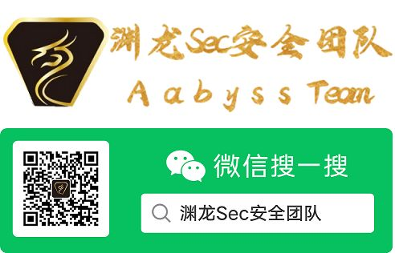

# About Me

- 👋 Hi, My ID is [AabyssZG](https://twitter.com/AabyssZG), 你可以叫我曾哥
- 👀 I'm good at 云安全、红蓝攻防和渗透测试
- 🌱 I'm currently learning 区块链、DevSecOps
- 📫 日常活跃于各大平台, 推特ID [@AabyssZG](https://twitter.com/AabyssZG)
- 👋 My Blog: [https://blog.zgsec.cn](https://blog.zgsec.cn)
- 🌱 JetBrains OSS Developer（使用JetBrains OSS 开源许可证进行开发）
- 💞️ 感谢Github开源社区，感谢JetBrains对 `Open source code` 做出的贡献

# About MyWork

现在我在国际云安全联盟（CSA）渗透测试工作组做云安全方面的研究

云安全联盟大中华区官网：[https://www.c-csa.cn](https://www.c-csa.cn)

# About MyTeam

我是渊龙Sec安全团队的负责人，团队英文名：AabyssTeam

- 团队官网：[https://www.aabyss.cn](https://www.aabyss.cn)
- 团队导航：[https://dh.aabyss.cn](https://dh.aabyss.cn)
- 团队博客：[https://blog.aabyss.cn](https://blog.aabyss.cn)
- 团队开源地址：[https://github.com/Aabyss-Team/](https://github.com/Aabyss-Team/)
- 团队威胁情报：[https://threat.aabyss.cn/](https://threat.aabyss.cn)
- 💞️ 团队公众号“渊龙Sec安全团队”，欢迎各位师傅进行合作
- 📫 我的QQ：MTI4MTY3MzI4Mw==, 如有需要可以联系我
- 👋 MyTeam E-Mail: root@aabyss.cn

# My Future

<table>
  <tr>
    <td>🥰恭喜您成为第</td>
    <td></td>
    <td>位访客，感谢您的关注和支持~😍</td>
  </tr>
</table>

- 👀 会尝试上传我自己整理的一些笔记, 以及我自己做的一些安全相关的工具
- 🌱 维护好团队项目, 开发出更多的优质项目
- 👋 分享优质渗透测试的骚姿势，欢迎师傅们和我交流~
